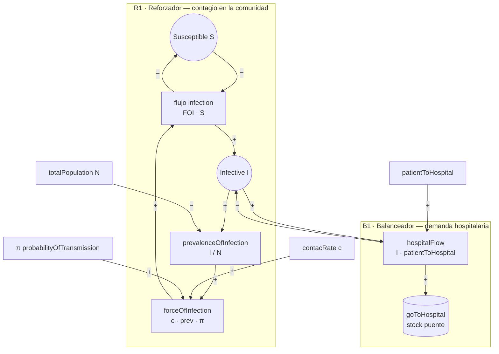
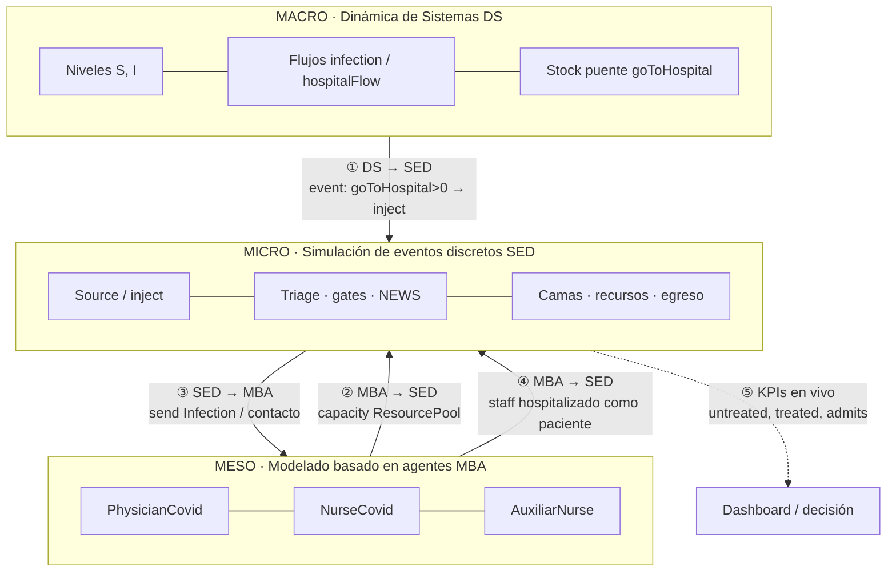
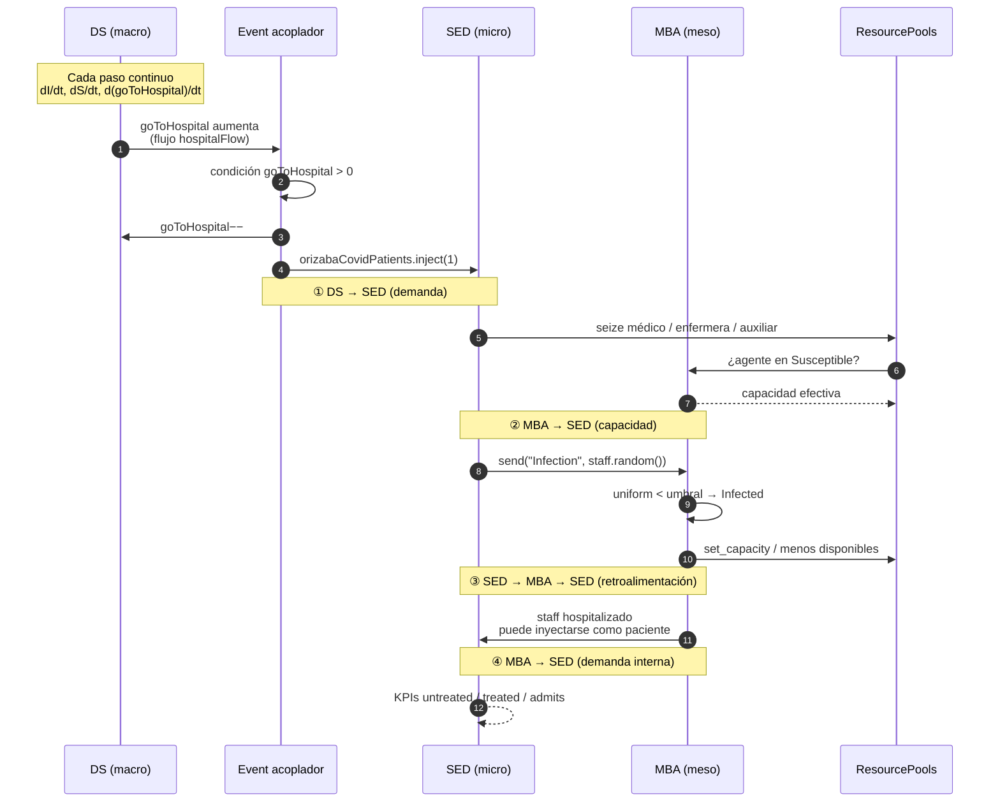
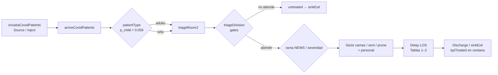
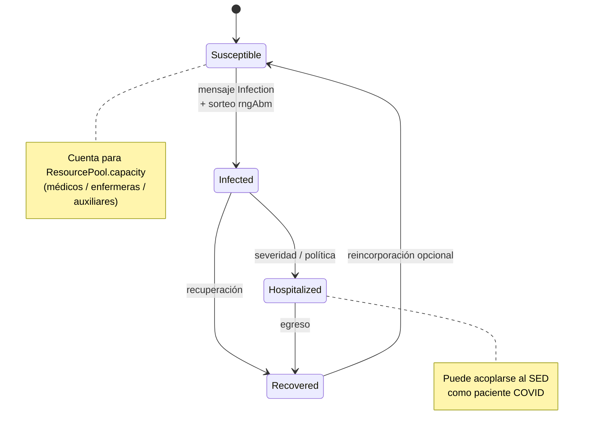

# Diagramas del modelo híbrido (DS · MBA · SED)

Réplica AnyLogic — Meza-Palacios et al. (2026).  
Modelo: `Modelo_Entrega5_Hospital_Hibrido_streams.alp`

Convención de signos (ciclos causales): **`+`** = mismo sentido · **`−`** = sentido opuesto.

---

## 1. Diagrama de ciclos causales (Dinámica de Sistemas)

Población de Orizaba (macro). El contagio refuerza la prevalencia; la hospitalización drena infectados hacia la demanda hospitalaria.

### Lectura rápida

| Ciclo | Tipo | Idea |
|---|---|---|
| **R1** | Reforzador | Más infectados → más prevalencia → más FOI → más infecciones |
| **B1** | Balanceador | Más infectados → más flujo al hospital → baja I en la comunidad |

Parámetros de entrega: \(c=2.65\), \(\pi=0.04\), \(p_{2h}=0.009\), \(N=123182\), \(I_0=3400\).

---

## 2. Tres niveles: macro · meso · micro

| Nivel | Pregunta que responde | Objetos AnyLogic |
|---|---|---|
| **Macro DS** | ¿Cuánta gente enferma y busca hospital? | Stocks, flows, `forceOfInfection` |
| **Meso MBA** | ¿Cuánto personal sano queda? | Poblaciones + statecharts |
| **Micro SED** | ¿Quién entra, espera o se va sin atención? | Process Modeling Library |

---

## 3. Comunicación bidireccional en tiempo de ejecución

La acoplamiento **no** es post-proceso: ocurre en el mismo reloj de simulación (Borshchev, 2013).

### Demostración matemática del acoplamiento

**① DS → SED (demanda continua → arribos discretos)**

\[
\begin{aligned}
\text{hospitalFlow} &= I(t)\cdot p_{2h} \\
\frac{d}{dt}\texttt{goToHospital} &= \text{hospitalFlow} \\
\text{si }\texttt{goToHospital}>0 &\Rightarrow
\begin{cases}
\texttt{goToHospital}\leftarrow\texttt{goToHospital}-1 \\
\texttt{inject}(1)\ \text{en SED}
\end{cases}
\end{aligned}
\]

Unidades: el stock puente convierte un **flujo continuo** (personas/día) en **entidades enteras** del process flowchart.

**② MBA → SED (capacidad)**

\[
\texttt{ResourcePool.capacity}
\;=\;
\#\{\,a\in\text{staff}: a\in\texttt{Susceptible}\,\}\quad (+ \text{ajustes de política})
\]

Si el personal se infecta, la capacidad cae **en el mismo instante de simulación** en que el statechart cambia.

**③ SED → MBA (exposición)**

\[
\mathbb{P}(\text{mensaje Infection})
\;=\;
f(\text{contacto en servicio, umbrales }0.04\text{ / }0.3,\ \texttt{rngAbm})
\]

El mensaje `send("Infection", …)` altera el meso; el meso altera el ResourcePool; el SED siente colas/timeouts → **lazo cerrado**.

**④ MBA → SED (staff como paciente)**

Agente en estado hospitalizado puede convertirse en entidad del flujo COVID → misma ruta micro que un paciente de la comunidad.

---

## 4. Flujo de procesos SED (detalle operativo)

Gates de entrega (contables Tabla 5): triage ≈ `0.00879` · untreated ≈ `0.01292`.  
Recursos: 80 camas COVID, 50 vent, 50 prone (paper).

---

## 5. Máquina de estados MBA (personal)

---

## 6. Resumen para la rúbrica

| Criterio | Dónde se ve |
|---|---|
| Niveles macro / meso / micro | §2 |
| Ciclos causales DS | §1 |
| Diagrama de flujo de procesos | §4 |
| Comunicación bidireccional en runtime | §3 (secuencia + ecuaciones) |
| Implementación | Event `goToHospital>0` + `inject`; `send("Infection")`; capacities de pools |

Archivos relacionados: `PARAMETROS_COMPROMISO_JOINT.md`, `RESULTADOS_STREAMS.md`, `index.html` (slides 03 y 06).
